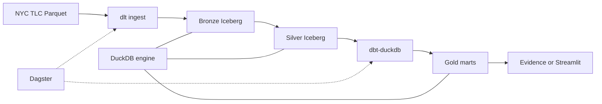

# Project plan — NYC Taxi Lakehouse Lite

This document mirrors the learning roadmap. Track progress by checking phases off in git or in your notes.

## Architecture

## Phase checklist

### Phase 0 — Scaffold (done)

- [x] New repo `nyc-taxi-lakehouse-lite`
- [x] uv + Python 3.11, ruff, pytest, pre-commit
- [x] `LakehouseConfig` + local/cloud profiles
- [x] Dagster `lakehouse_bootstrap` asset
- [x] dbt project skeleton
- [x] GitHub Actions CI

### Phase 1 — Bronze

- [ ] dlt source for NYC TLC yellow taxi (1–2 years)
- [ ] pyiceberg table + partitioning (e.g. by month)
- [ ] Idempotent re-runs documented

### Phase 2 — Silver

- [x] Polars/DuckDB cleaning pipeline
- [x] pandera schema + range checks
- [x] Iceberg schema evolution example

### Phase 3 — Incremental

- [ ] Monthly partitions in Dagster
- [ ] pyiceberg upserts / merge pattern
- [ ] Backfill runbook

### Phase 4 — Gold

- [ ] `fact_trips`, `dim_zone`, `dim_date`
- [ ] dbt tests + `dbt docs generate`

### Phase 5 — Tuning

- [ ] File size / partition review
- [ ] Before/after query benchmarks (DuckDB EXPLAIN)

### Phase 6 — Serving

- [ ] Simple dashboard on gold marts

### Phase 7 — Cloud (optional)

- [ ] Object storage for `lake/`
- [ ] One distributed Spark exercise (free tier)

### Phase 8 — Polish

- [ ] Architecture write-up for interviews
- [ ] CI coverage for critical paths

## Senior skills map

| Skill | Where |
|-------|--------|
| Medallion design | Phases 1–4 |
| Iceberg format | Phases 1–3, 5 |
| Idempotent pipelines | Phases 1, 3 |
| Data contracts | Phase 2 |
| Analytics engineering | Phase 4 |
| Orchestration | Phase 3+ |
| Performance | Phase 5 |
| Distributed Spark | Phase 7 only |
